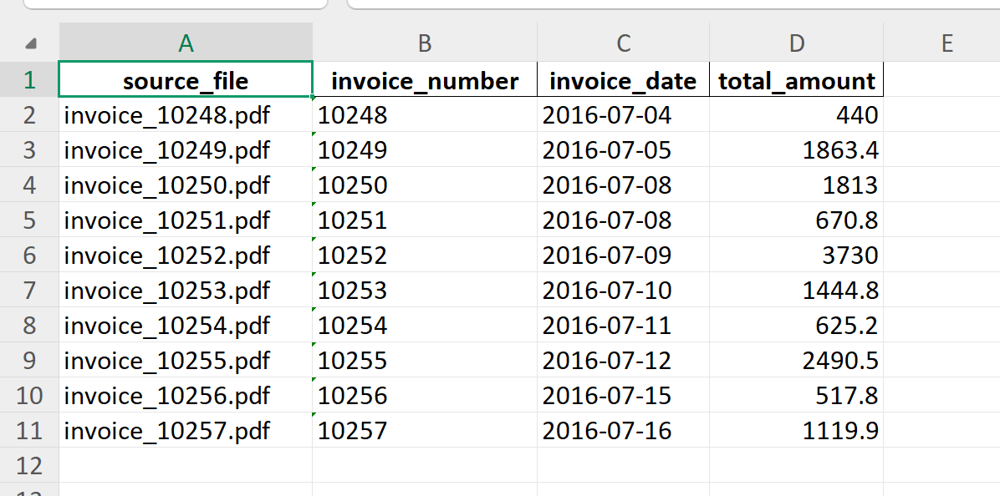

You’re right — I gave you a “mostly complete” README but it **left gaps** (and some lines were vague like “configured via YAML template” without showing it). Here’s a **full, consistent, paste-ready `README.md`** in proper Markdown, with **no missing sections**, plus a **real YAML template example**, **how outputs/logs work**, and **OCR note**.

Copy-paste this as the entire `README.md`:

```markdown
# PDF Invoice Parser (PDF → CSV / Excel)

A production-style Python tool that batch-processes invoice PDFs, extracts structured fields, normalizes values, and exports results to **CSV** and **Excel (.xlsx)**.

Supports both:
- **Text-based PDFs** (fast extraction via `pdfplumber`)
- **Scanned PDFs** (OCR fallback via `pytesseract`)

---

## ✨ Features

- ✅ Text PDF extraction (fast)
- ✅ OCR fallback for scanned PDFs
- ✅ Batch processing (folder of PDFs)
- ✅ Template-driven parsing (YAML profiles per vendor/layout)
- ✅ Regex-based field extraction
- ✅ Normalized dates (`YYYY-MM-DD`) and amounts (2 decimals)
- ✅ Confidence scoring per extracted field
- ✅ Duplicate detection
- ✅ CSV + Excel export
- ✅ Logging + per-file error handling (continues even if one PDF fails)

---

## 📸 Example Output

Generated Excel output after processing sample invoices:



---

## 📁 Project Structure

```

pdf-invoice-parser/
├── assets/
│   └── example_output.png
│
├── invoice_parser/
│   ├── **init**.py
│   ├── config_loader.py          # Load config / template profiles (YAML)
│   ├── template_loader.py        # Load template rules
│   ├── text_detect.py            # Detect text-based vs scanned PDFs
│   ├── ocr.py                    # OCR pipeline (Tesseract)
│   ├── extract_fields.py         # Field extraction (regex rules)
│   ├── normalize.py              # Normalize dates/amounts
│   ├── confidence.py             # Confidence scoring
│   ├── duplicates.py             # Duplicate detection
│   ├── export.py                 # CSV/XLSX export
│   └── logger_setup.py           # Logging setup
│
├── templates/                    # YAML template profiles (vendor/layout rules)
├── samples/                      # Example PDFs for testing
│   ├── invoice_10248.pdf
│   ├── invoice_10249.pdf
│   └── ...
│
├── main.py                       # Entry point (batch runner)
├── requirements.txt
├── README.md
└── .gitignore

````

---

## ⚙️ Installation

### 1) Clone the repository

```bash
git clone https://github.com/6302Mohamed/pdf-invoice-parser.git
cd pdf-invoice-parser
````

### 2) Install Python dependencies

```bash
pip install -r requirements.txt
```

---

## 🧾 OCR Requirement (for scanned PDFs)

OCR uses **Tesseract**, which is a system dependency:

* **Ubuntu / Debian**

  ```bash
  sudo apt-get update
  sudo apt-get install -y tesseract-ocr
  ```
* **macOS**

  ```bash
  brew install tesseract
  ```
* **Windows**
  Install Tesseract from an official installer and ensure it is on PATH.

> If Tesseract is not installed, the parser can still process **text-based PDFs**.

---

## ▶️ Quick Start

1. Put invoice PDFs inside:

```
samples/
```

2. Run:

```bash
python main.py
```

---

## 📤 Outputs

After running, the tool exports:

* `CSV` output (structured rows)
* `Excel (.xlsx)` output

> Exact output filenames/paths depend on your config/template setup (see Templates section below).

---

## 🧠 How It Works (Pipeline)

1. Read PDF file
2. Detect whether PDF has a usable text layer (`text_detect.py`)
3. If text exists → extract with `pdfplumber`
4. If scanned → OCR using `pytesseract` (`ocr.py`)
5. Load template profile (`templates/*.yml`)
6. Extract fields using template regex rules (`extract_fields.py`)
7. Normalize values (`normalize.py`)
8. Compute confidence score (`confidence.py`)
9. Check duplicates (`duplicates.py`)
10. Export CSV + Excel (`export.py`)
11. Log results (`logger_setup.py`)

---

## 📊 Extracted Fields

Typical invoice fields extracted:

| Field        | Description                |
| ------------ | -------------------------- |
| Invoice ID   | Invoice / Order identifier |
| Date         | Invoice issue date         |
| Total Amount | Final payable total        |

Templates can define additional fields depending on the invoice layout.

---

## 🧩 Templates (YAML Profiles)

Templates live inside:

```
templates/
```

A template describes *how to extract fields* for a specific invoice layout/vendor.

### Example Template (YAML)

Create something like `templates/default.yml`:

```yaml
name: default
fields:
  invoice_id:
    patterns:
      - "Invoice\\s*No\\.?\\s*[:#]?\\s*([A-Z0-9-]+)"
      - "Order\\s*ID\\s*[:#]?\\s*([A-Z0-9-]+)"
  date:
    patterns:
      - "Date\\s*[:]?\\s*([0-9]{2}/[0-9]{2}/[0-9]{4})"
      - "Date\\s*[:]?\\s*([0-9]{4}-[0-9]{2}-[0-9]{2})"
    normalize: date
  total_amount:
    patterns:
      - "Total\\s*[:]?\\s*\\$?\\s*([0-9,]+\\.?[0-9]{0,2})"
      - "Grand\\s*Total\\s*[:]?\\s*\\$?\\s*([0-9,]+\\.?[0-9]{0,2})"
    normalize: amount
```

**What this gives you:**

* Add a new vendor/layout by adding a new `.yml`
* No code changes needed for new invoice formats (just templates)

> Your codebase already includes loaders (`config_loader.py`, `template_loader.py`) to support this.

---

## 🧯 Error Handling & Logging

* Each PDF is processed independently.
* If a file fails (corrupt PDF, OCR error, missing fields), it is logged and the script continues.
* Logging is configured via `invoice_parser/logger_setup.py`.

This makes it safe to run on large batches.

---

## 📦 Dependencies

From `requirements.txt`:

```txt
pdfplumber>=0.11.0
pytesseract>=0.3.10
Pillow>=10.0.0
PyYAML>=6.0.1
pandas>=2.2.0
openpyxl>=3.1.2
```

---

## 🔧 Customization

To support new invoice formats:

1. Add a new YAML file in `templates/`
2. Define regex extraction rules for fields
3. Run the parser on that vendor’s PDFs

Optional enhancements you can add later:

* more fields (VAT, supplier name, currency, line items)
* template auto-detection
* parallel processing

---

## 📌 Roadmap

* [ ] CLI arguments (input folder, template name, output folder)
* [ ] Docker support
* [ ] API mode (FastAPI)
* [ ] Template auto-detection
* [ ] Parallel processing for large batches

---

## 👨‍💻 Author

**Mohamed Yousuf Husein**
AI Engineer • Automation Developer • Data Systems Builder

---

## 📄 License

MIT License — free to use, modify, and distribute.

---

## ⭐ Support

If you found this useful:

* ⭐ Star the repo
* 🍴 Fork it
* 🧠 Contribute improvements

```

### If you want it *perfectly matched* to your exact runtime behavior
Your `main.py` probably writes outputs/logs to specific filenames/paths and maybe selects a template name in code. If you paste your `main.py` (or just the part that loads config/templates and exports), I’ll adjust the README so **every command/output path is 100% accurate**.
```
